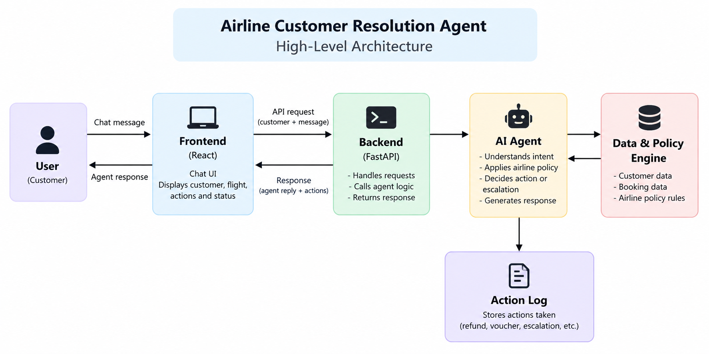

````markdown
# ✈️ SkyResolve — Customer-Facing Resolution Agent

> A policy-aware AI resolution agent for handling airline cancellations, delays, refunds, rebooking and escalation.

Built as part of the **AionOS Customer-Facing Resolution Agent** assignment.

---

## 🚀 Overview

SkyResolve is a customer-facing airline disruption resolution agent designed to handle realistic customer support journeys.

The agent can:

- Understand customer intent
- Identify the customer's booking and disruption
- Retrieve information from supplied customer and booking data
- Apply airline policies
- Execute permitted actions
- Explain when a request cannot be fulfilled
- Escalate requests that exceed the agent's authority
- Maintain a clear action record for every executed action

The system is designed around a simple principle:

> **Resolve what the policy allows. Escalate what the agent is not authorized to do.**

---

## 🎯 Problem

Airline disruptions often require customers to navigate multiple decisions:

- What happened to my flight?
- Can I get a refund?
- Can I rebook?
- Am I eligible for compensation?
- Can I get a hotel?
- Can the airline waive a fare difference?
- What happens when my request falls outside the agent's authority?

A useful resolution agent should not simply generate a conversational response.

It should **understand → verify → apply policy → act → escalate when necessary.**

---

## 🧩 Key Features

### 1. Customer & Booking Identification

The system uses the supplied customer and booking records to identify:

- Customer name
- Loyalty tier
- Booking reference
- Flight
- Route
- Date
- Disruption status
- Delay duration

### 2. Intent Understanding

The agent distinguishes between requests such as:

- Refund
- Rebooking
- Delay assistance
- Hotel request
- Lounge access
- Meal voucher
- Fare-difference request
- Unsupported compensation
- Business-class upgrade
- General information

### 3. Policy-Aware Resolution

The agent uses the supplied airline policies to determine which actions are permitted.

For example:

```text
Cancellation
      ↓
Free rebooking within 24h
        OR
Full refund
````

For delays:

```text
3+ hours
   ↓
Meal voucher + Lounge

>5 hours
   ↓
Meal + Lounge + Hotel
   ↓
Hotel covers delayed hours only
```

### 4. Bounded Authority

The agent does not invent exceptions or override policy.

Requests outside its authority are escalated.

Example:

```text
Fare difference = ₹2,000
Agent authority = ₹1,500
          ↓
     Human review
```

### 5. Action Record

Every action taken by the agent is displayed in the UI.

Examples:

* `refund_request`
* `meal_voucher`
* `lounge_access`
* `hotel_accommodation`
* `escalation`

This provides a simple audit trail of what happened during the conversation.

---

## 🏗️ Architecture

```text
                    ┌───────────────┐
                    │    Customer   │
                    └───────┬───────┘
                            │
                       Chat Message
                            │
                            ▼
                    ┌───────────────┐
                    │ React / Vite  │
                    │   Frontend    │
                    └───────┬───────┘
                            │
                         REST API
                            │
                            ▼
                    ┌───────────────┐
                    │    FastAPI    │
                    │    Backend    │
                    └───────┬───────┘
                            │
                            ▼
                    ┌───────────────┐
                    │  AI Agent /   │
                    │ Orchestration │
                    └───────┬───────┘
                            │
              ┌─────────────┼─────────────┐
              ▼             ▼             ▼
        Customer Data   Booking Data   Policy Engine
        customers.json bookings.json  policies.json
              │             │             │
              └─────────────┼─────────────┘
                            ▼
                    ┌───────────────┐
                    │    Decision   │
                    │     Layer     │
                    └───────┬───────┘
                            │
                   ┌────────┴────────┐
                   ▼                 ▼
             Allowed Action      Escalation
                   │                 │
                   └────────┬────────┘
                            ▼
                    ┌───────────────┐
                    │  Action Log   │
                    └───────────────┘
```

---

## 🛠️ Technology Stack

### Frontend

* React
* Vite
* JavaScript
* CSS

### Backend

* Python
* FastAPI
* Pydantic

### Data & Decision Layer

* JSON-based customer data
* JSON-based booking data
* JSON-based airline policies
* Policy engine
* Action logging

---

## 📁 Project Structure

```text
airline-resolution-agent/
│
├── backend/
│   ├── data/
│   │   ├── customers.json
│   │   ├── bookings.json
│   │   └── policies.json
│   │
│   ├── agent.py
│   ├── policy_engine.py
│   └── main.py
│
├── frontend/
│   ├── src/
│   │   ├── components/
│   │   │   ├── ActionRecord.jsx
│   │   │   ├── Chat.jsx
│   │   │   ├── FlightCard.jsx
│   │   │   ├── PassengerCard.jsx
│   │   │   └── ResolutionSteps.jsx
│   │   │
│   │   ├── App.jsx
│   │   └── styles.css
│   │
│   ├── package.json
│   └── vite.config.js
│
├── README.md
└── architecture.png
```

---

## 👥 Demonstrated Customer Scenarios

The prototype contains three supplied customer journeys.

### Priya Nair — Cancelled Flight

**Scenario**

Flight SK-204 from Delhi → Goa is cancelled due to operational reasons.

The customer requests:

1. Full refund
2. Free business-class upgrade on the return flight

**Agent behaviour**

```text
Cancellation detected
        ↓
Full refund requested
        ↓
Refund initiated
        ↓
Business-class upgrade requested
        ↓
Outside supplied policy
        ↓
Human escalation
```

---

### Arvind Kulkarni — 4-Hour Delay

**Scenario**

Flight SK-118 from Mumbai → Bengaluru is delayed by 4 hours.

The customer asks about available assistance and then requests a hotel.

**Agent behaviour**

```text
4-hour delay
     ↓
Meal voucher ✓
Lounge access ✓
Hotel ✗
     ↓
Policy does not provide hotel
for a 4-hour delay
```

The agent does not create an unsupported hotel action.

---

### Meher Kaur — 6-Hour Delay

**Scenario**

Flight SK-305 from Delhi → Hyderabad is delayed by 6 hours.

The customer requests:

1. Hotel for the entire night
2. A different higher-fare flight with a ₹2,000 fare difference

**Agent behaviour**

```text
6-hour delay
     ↓
Meal voucher ✓
Lounge access ✓
Hotel ✓
     ↓
Hotel limited to delayed hours
```

For the ₹2,000 fare-difference request:

```text
₹2,000 requested
       ↓
Agent authority ≤ ₹1,500
       ↓
Supervisor escalation
```

---

## 🔐 Policy & Authority Model

The agent follows the supplied policies rather than generating its own rules.

| Situation                     | Agent Action                             |
| ----------------------------- | ---------------------------------------- |
| Airline-caused cancellation   | Free rebooking within 24h OR full refund |
| Refund                        | Original payment method                  |
| Refund processing             | Within 7 business days                   |
| Delay ≥ 3h                    | Meal voucher + lounge                    |
| Delay > 5h                    | Hotel for delayed hours                  |
| Gold / Platinum               | Priority rebooking                       |
| Fare waiver > ₹1,500          | Supervisor approval                      |
| Unsupported compensation      | Escalate                                 |
| Legal/formal complaint        | Escalate                                 |
| Refund to non-original method | Escalate                                 |

---

## 🔄 Resolution Flow

```text
Customer Request
      ↓
Identify Customer
      ↓
Verify Booking
      ↓
Understand Intent
      ↓
Retrieve Relevant Facts
      ↓
Apply Policy
      ↓
┌─────────────────────┐
│ Is action allowed?  │
└──────────┬──────────┘
           │
      ┌────┴────┐
      │         │
     YES        NO
      │         │
      ▼         ▼
 Execute      Escalate
 Action       to Human
      │         │
      └────┬────┘
           ▼
      Action Record
           ↓
      Customer Response
```

---

## 🧠 Design Principles

### Policy First

The agent uses the supplied policies as the source of truth.

### Bounded Authority

The agent does not make decisions outside its permitted authority.

### No Hallucinated Rules

If a policy does not provide an action, the agent does not invent one.

### Minimal Customer Effort

The agent uses the available customer and booking information instead of repeatedly asking for information already available.

### Explainable Actions

The UI exposes the actions taken during the current conversation.

### Human-in-the-Loop

Requests requiring an exception, supervisor approval or unsupported resolution are routed for human review.

---

## ▶️ Running the Project Locally

### 1. Clone the repository

```bash
git clone <YOUR_GITHUB_REPOSITORY_URL>
cd airline-resolution-agent
```

### 2. Start the backend

```bash
cd backend

python -m venv .venv
```

Windows:

```powershell
.venv\Scripts\Activate.ps1
```

Install dependencies:

```bash
pip install -r requirements.txt
```

Start FastAPI:

```bash
uvicorn main:app --reload
```

Backend runs at:

```text
http://127.0.0.1:8000
```

### 3. Start the frontend

Open another terminal:

```bash
cd frontend
npm install
npm run dev
```

Frontend runs at:

```text
http://localhost:5173
```

---

## 🔌 API Endpoints

### `GET /`

Checks whether the backend is running.

### `GET /customers`

Returns the supplied customer records.

### `GET /bookings`

Returns the supplied booking records.

### `POST /chat`

Processes a customer request.

Example:

```json
{
  "customer": "Priya Nair",
  "message": "I want a full refund"
}
```

### `GET /actions`

Returns the recorded actions.

The endpoint can also be filtered by booking reference:

```text
/actions?pnr=SK4821X
```

---

## 📌 Assumptions & Scope

* Only the provided customer, booking and policy data is used.
* No real airline booking system is connected.
* Actions such as refunds and vouchers are represented as prototype actions.
* Real payment/refund execution would require integration with airline systems.
* Human escalation is represented through the action record.
* The prototype focuses on the resolution decision flow rather than production airline infrastructure.

---

## 🎥 Demo
Demo Link -https://drive.google.com/file/d/13XIhoNKfym3dOGuldo5n7CU4X4IlPWVw/view?usp=sharing
The demo demonstrates:

1. Customer selection
2. Booking verification
3. Natural-language request
4. Policy-based resolution
5. Action execution
6. Restricted-request escalation
7. Action record and case status

---

## 👩‍💻 Built For

**AionOS — Customer-Facing Resolution Agent Assignment**

**Use Case:** Airline Disruption Resolution

**Prototype:** SkyResolve

````

```markdown

```
